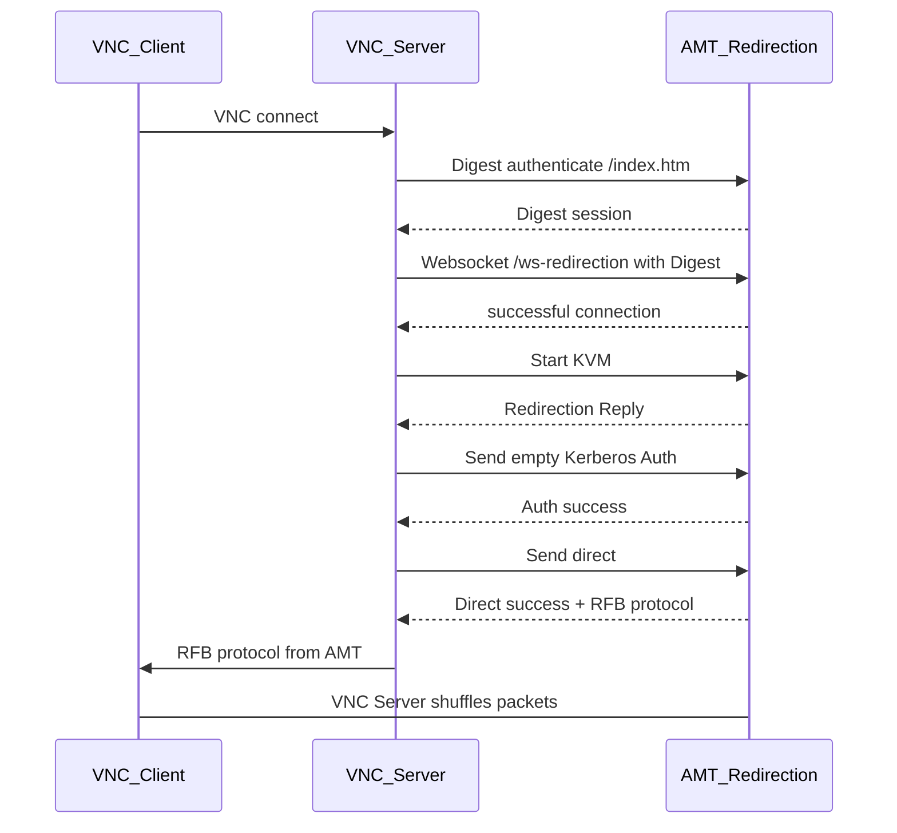
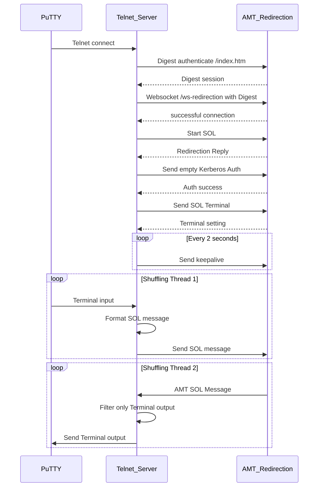

# pyws

A simple Python WSMAN library using lxml and some AMT commandline utilities.

## AMT KVM VNCViewer launcher

This utility will start VNC server at a random TCP port, delay executes VNC client to connect to the specified random port, establish authenticated websocket redirection session to AMT system upon accepting VNC client connection, and then shuffles the packet between websocket and VNC connection.

## AMT SOL PuTTY launcher

This utility will start Telnet server at a random TCP port, delay executes PuTTY client to connect to the specified random port, establish authenticated websocket redirection session to AMT system upon accepting VNC client connection, and then shuffles the packet between websocket and Telnet connection.

